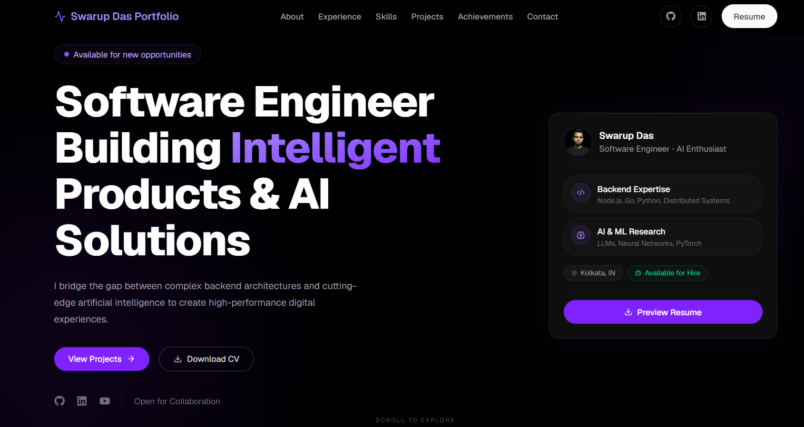
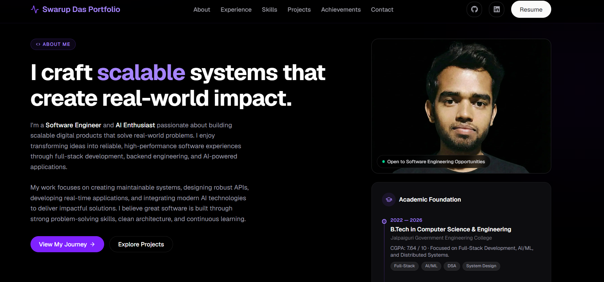
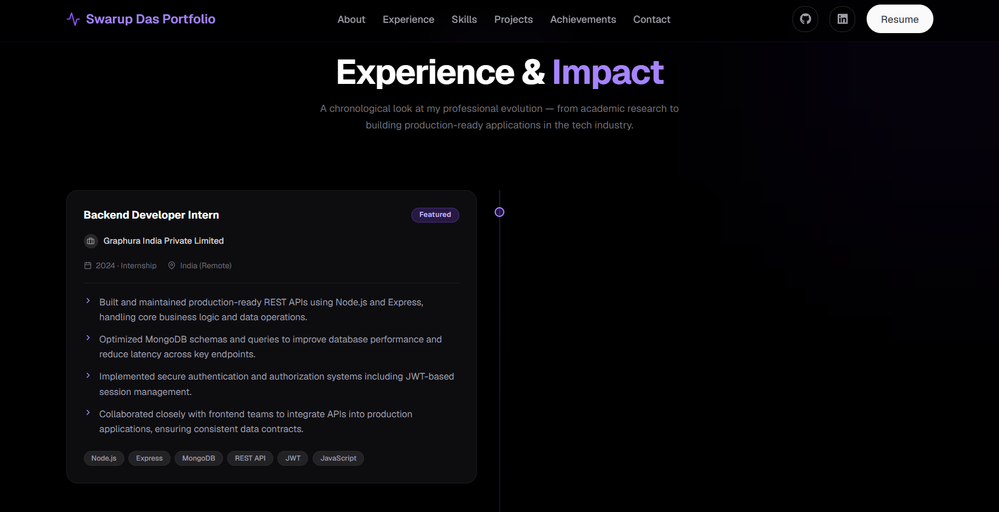
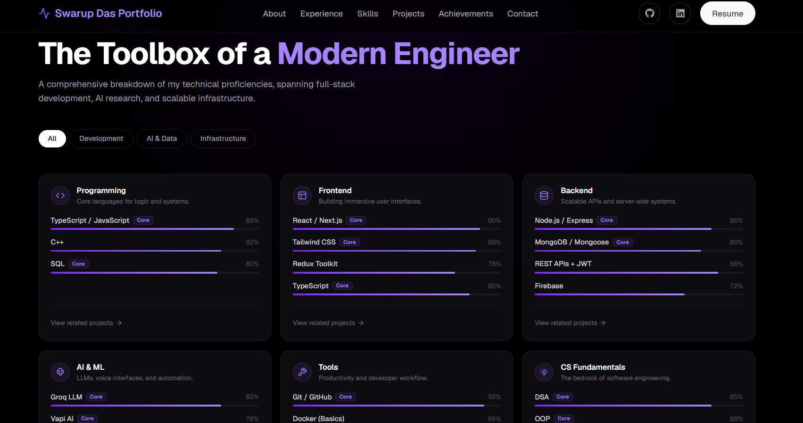
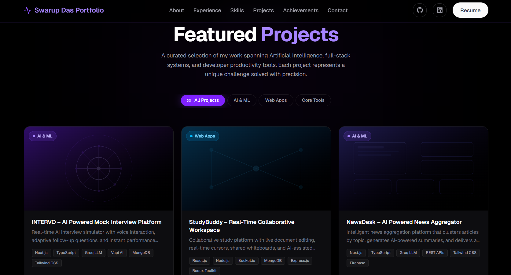
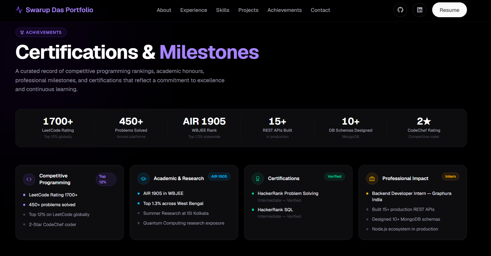

<div align="center">

# ✦ Swarup Das — Portfolio

### *Building Scalable Products & AI Solutions with Modern Engineering*

[](https://modern-portfolio-cyan.vercel.app/)
[](https://github.com/swarupdas)
[](https://nextjs.org/)
[](https://www.typescriptlang.org/)
[](https://tailwindcss.com/)
[](https://vercel.com/)

<br/>

> *A high-performance, production-grade personal portfolio built with Next.js App Router, TypeScript, and Framer Motion — designed to make a lasting impression.*

<br/>

</div>

---

## 📌 Overview

This portfolio is more than a personal website — it is an **engineering statement**. Built from the ground up with a focus on performance, accessibility, and modern design, it serves as the definitive showcase of Swarup Das's work as a Software Engineer and AI Enthusiast.

**Why this portfolio exists:**

- To present real-world engineering work with clarity and precision to recruiters and engineering teams
- To demonstrate mastery of the modern frontend stack in a production-ready codebase
- To reflect a design philosophy rooted in minimalism, purposeful motion, and clean information hierarchy
- To serve as a living document of professional growth — continuously updated as new skills and projects emerge

**Design philosophy:** Every element earns its place. Smooth Framer Motion animations guide attention without noise. The layout breathes. The typography communicates hierarchy. On mobile or desktop, the experience feels native and intentional.

---

## ✨ Features

- **🎨 Modern UI/UX** — Minimal dark-themed design with refined typography and purposeful whitespace
- **📱 Fully Responsive** — Pixel-perfect layouts across all screen sizes and devices
- **🌀 Smooth Animations** — Framer Motion-powered entrance animations, transitions, and micro-interactions
- **🧩 Interactive Components** — Filterable project grid, animated skill meters, tabbed sections, and live contact form
- **🗂️ Experience Timeline** — Clean chronological view of professional roles and research engagements
- **📊 Skills Showcase** — Categorized skill panels with proficiency indicators across six domains
- **🚀 Project Showcase** — Filterable, card-based project gallery with live demo and GitHub links
- **🏆 Achievements Section** — Competitive programming ratings, certifications, and academic honours
- **✉️ Contact Form** — Functional, accessible contact form with validation
- **⚡ Performance Optimized** — Next.js App Router, image optimization, and code splitting out of the box
- **🔍 SEO Friendly** — Rich Open Graph metadata, semantic HTML, and structured page titles

---

## 🗂️ Portfolio Sections

| Section | Description |
|---|---|
| **Hero** | Full-screen introduction with role, tagline, social links, and resume CTA |
| **About** | Personal narrative, academic background, core specializations, and problem-solving mindset |
| **Experience** | Professional timeline covering Backend Developer Internship at Graphura India and Summer Research at ISI Kolkata |
| **Skills** | Six-category skill grid — Programming, Frontend, Backend, AI & ML, Tools, and CS Fundamentals |
| **Projects** | Filterable showcase of featured projects: INTERVO, StudyBuddy, and NewsDesk |
| **Achievements** | Competitive programming rankings, certifications, academic honours, and professional impact metrics |
| **Contact** | Actionable contact section with form, email, phone, and all social links |
| **CTA** | Closing call-to-action encouraging collaboration, job opportunities, and resume download |

---

## 🛠️ Tech Stack

| Layer | Technology | Purpose |
|---|---|---|
| **Framework** | [Next.js 15](https://nextjs.org/) | App Router, SSR, routing, and performance |
| **Language** | [TypeScript](https://www.typescriptlang.org/) | Type safety and developer experience |
| **Styling** | [Tailwind CSS](https://tailwindcss.com/) | Utility-first responsive design system |
| **Animation** | [Framer Motion](https://www.framer.com/motion/) | Declarative animations and page transitions |
| **UI Library** | [React 18](https://react.dev/) | Component-based UI architecture |
| **Deployment** | [Vercel](https://vercel.com/) | Zero-config CI/CD and global edge delivery |
| **Version Control** | [Git & GitHub](https://github.com/) | Source control and open-source collaboration |

---

## 📁 Project Structure

```
modern-portfolio/
├── app/
│   ├── layout.tsx              # Root layout with metadata and fonts
│   ├── page.tsx                # Home page (single-page portfolio)
│   ├── resume/
│   │   └── page.tsx            # Resume viewer page
│   └── globals.css             # Global styles and CSS variables
├── components/
│   ├── sections/
│   │   ├── Hero.tsx            # Hero section with animated intro
│   │   ├── About.tsx           # About, education, and philosophy
│   │   ├── Experience.tsx      # Professional experience timeline
│   │   ├── Skills.tsx          # Filterable skills showcase
│   │   ├── Projects.tsx        # Project grid with category filters
│   │   ├── Achievements.tsx    # Milestones, ratings, and certifications
│   │   ├── Contact.tsx         # Contact form and social links
│   │   └── CTA.tsx             # Closing call-to-action section
│   ├── ui/
│   │   ├── Badge.tsx           # Reusable tech/skill badge
│   │   ├── Button.tsx          # Primary and ghost button variants
│   │   ├── Card.tsx            # Project and experience card
│   │   └── Navbar.tsx          # Sticky navigation with scroll detection
│   └── layout/
│       ├── Header.tsx          # Site header with nav links
│       └── Footer.tsx          # Footer with socials and copyright
├── public/
│   ├── images/
│   │   └── profile.jpeg        # Profile photograph
│   └── resume.pdf              # Downloadable CV
├── lib/
│   └── data.ts                 # Projects, skills, and experience data
├── types/
│   └── index.ts                # Shared TypeScript type definitions
├── next.config.ts              # Next.js configuration
├── tailwind.config.ts          # Tailwind theme and plugin config
├── tsconfig.json               # TypeScript compiler options
└── package.json                # Dependencies and scripts
```

---

## 📸 Screenshots

### Hero Section
> *Full-screen introduction with animated role text, professional tagline, and CTAs*



### About Section
> *Personal story, academic timeline, core specializations, and engineering philosophy*



### Experience Section
> *Chronological professional timeline — Backend Internship at Graphura India and Summer Research at ISI Kolkata*



### Skills Section
> *Six-category skill grid with animated proficiency meters across Programming, Frontend, Backend, AI & ML, Tools, and CS Fundamentals*



### Projects Section
> *Filterable project showcase with live demo badges and GitHub links*



### Achievements Section
> *Competitive programming rankings, HackerRank certifications, academic honours, and professional impact metrics*



---

## 🚀 Getting Started

### Prerequisites

- [Node.js](https://nodejs.org/) v18 or higher
- [npm](https://www.npmjs.com/) v9 or higher

### Local Setup

**1. Clone the repository**

```bash
git clone https://github.com/swarupdas/modern-portfolio.git
cd modern-portfolio
```

**2. Install dependencies**

```bash
npm install
```

**3. Start the development server**

```bash
npm run dev
```

Open [http://localhost:3000](http://localhost:3000) in your browser.

**4. Build for production**

```bash
npm run build
```

**5. Start the production server**

```bash
npm start
```

---

## ⚡ Performance

This portfolio is engineered for speed and accessibility:

- **Next.js App Router** — Server components by default, reducing client-side JavaScript
- **Image Optimization** — Automatic WebP conversion and lazy loading via `next/image`
- **Code Splitting** — Route-level and component-level splitting for minimal initial payloads
- **Responsive Design** — Mobile-first Tailwind breakpoints with no layout shift
- **Accessibility** — Semantic HTML5 elements, ARIA attributes, and keyboard-navigable components
- **SEO** — Comprehensive Open Graph and Twitter Card metadata for rich link previews

---

## ☁️ Deployment

This portfolio is deployed on **[Vercel](https://vercel.com/)** with automatic CI/CD on every push to the `main` branch.

```
Production:   https://modern-portfolio-cyan.vercel.app/
```

To deploy your own fork:

1. Push the repository to GitHub
2. Import the project at [vercel.com/new](https://vercel.com/new)
3. Vercel auto-detects Next.js — click **Deploy**

---

## 🔭 Future Improvements

The portfolio is actively maintained. Planned enhancements include:

- [ ] **Blog Integration** — MDX-powered writing section for technical articles and research notes
- [ ] **Dark / Light Theme Toggle** — System-aware theme switching with user preference persistence
- [ ] **CMS Integration** — Headless CMS (Sanity or Contentlayer) for content management without code changes
- [ ] **Project Case Studies** — Deep-dive pages for each featured project with architecture diagrams
- [ ] **Analytics Dashboard** — Privacy-first view analytics using Vercel Analytics or Plausible
- [ ] **Internationalisation (i18n)** — Multi-language support for a global audience

Contributions, suggestions, and feature requests are welcome — open an issue or submit a pull request.

---

## 👤 About the Developer

**Swarup Das** is a Software Engineer and AI Enthusiast currently completing his B.Tech in Computer Science & Engineering at Jalpaiguri Government Engineering College. He brings hands-on professional experience from a Backend Developer Internship at Graphura India, and academic research depth from a Summer Research Program at the Indian Statistical Institute (ISI), Kolkata, focused on Quantum Computing.

His core interests lie at the intersection of scalable backend systems, full-stack product development, and applied artificial intelligence — with a 1700+ LeetCode rating and 450+ problems solved reflecting a strong foundation in algorithms and data structures.

---

## 📬 Contact

Open to Software Engineering roles, AI collaborations, and open-source contributions.

| Platform | Link |
|---|---|
| 📧 **Email** | [swarup82546@gmail.com](mailto:swarup82546@gmail.com) |
| 💼 **LinkedIn** | [linkedin.com/in/swarupdas](https://linkedin.com/in/swarupdas) |
| 🐙 **GitHub** | [github.com/swarupdas](https://github.com/swarupdas) |
| 🌐 **Portfolio** | [modern-portfolio-cyan.vercel.app](https://modern-portfolio-cyan.vercel.app/) |
| 📍 **Location** | West Bengal, India |

---

## 📄 License

This project is open source and available under the [MIT License](./LICENSE).

---

<div align="center">

Designed and engineered with precision by **[Swarup Das](https://modern-portfolio-cyan.vercel.app/)** · Deployed on [Vercel](https://vercel.com/) · Built with [Next.js](https://nextjs.org/)

*If this project helped or inspired you, consider giving it a ⭐ — it means a lot.*

</div>